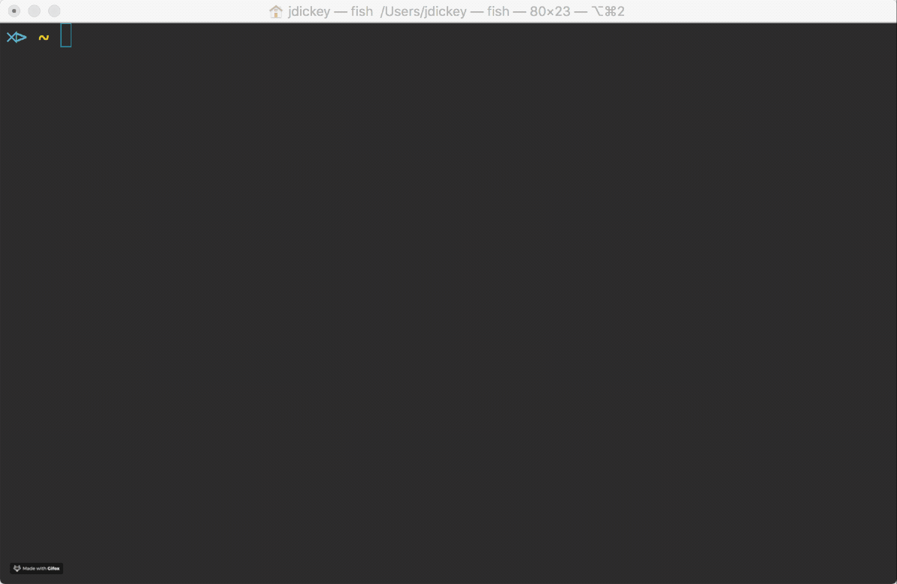

Local GitHub Navigator
======================

gh allows you to very quickly navigate between GitHub project cloned on your
local box. It will `cd` into project directories quickly and clone repos that do
not exist.

Here is a demo of me moving around various projects



Usage
=====

Go to `~/src/github.com/dickeyxxx`

```
gh
```

Go to `~/src/github.com/dickeyxxx/myrepo`

```
gh myrepo
```

Go to `~/src/github.com/otheruser/repo`

```
gh otheruser repo
```

If it does not already exist it will be cloned.

Note that tab completion is available for project names.

Dependencies
============

* [Fish shell](http://fishshell.com/) ([interested in a bash version?](https://github.com/dickeyxxx/gh/issues)) OR [OH-MY-ZSH](http://ohmyz.sh/)


Installation For Fish
=====================

Add this environment variable for your GitHub username

    set -U GITHUB dickeyxxx

Then symlink (or copy) the function and completion files into `$fish_function_path` and `$fish_complete_path`

    ln -s ~/src/github.com/dickeyxxx/gh/fish/functions/gh.fish ~/.config/fish/functions/gh.fish
    ln -s ~/src/github.com/dickeyxxx/gh/fish/completions/gh.fish ~/.config/fish/completions/gh.fish

Installation For Oh-My-ZSH
==========================

Add this environment variable for your GitHub username

    typeset +gx -A GITHUB
    GITHUB[user]=dickeyxxx

Then symlink (or copy) the gh folder into your Oh-My-ZSH plugins folder
    
    ln -s ~/src/github.com/dickeyxxx/gh/zsh/gh ~/.oh-my-zsh/custom/plugins/gh

Next add the plugin to your `~/.zshrc` file
    
    plugins=(gh)

For example:
    
```
# Which plugins would you like to load? (plugins can be found in ~/.oh-my-zsh/plugins/*)
# Custom plugins may be added to ~/.oh-my-zsh/custom/plugins/
# Example format: plugins=(rails git textmate ruby lighthouse)
plugins=(git brew meteor node npm osx redis-cli sublime gh)

```

Finally reload the `~/.zshrc` file:

    source ~/.zshrc

Go developers
=============

This follows the standard convention for Go projects so long as you have your
`GOHOME` set to `~`
